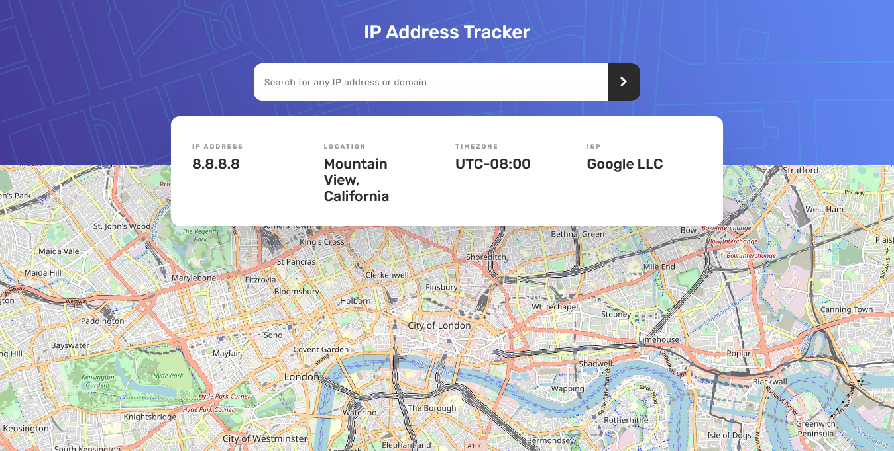

# Frontend Mentor - IP address tracker solution

This is a solution to the [IP address tracker challenge on Frontend Mentor](https://www.frontendmentor.io/challenges/ip-address-tracker-I8-0yYAH0). Frontend Mentor challenges help you improve your coding skills by building realistic projects.

## Table of contents

- [Overview](#overview)
  - [The challenge](#the-challenge)
  - [Screenshot](#screenshot)
  - [Links](#links)
- [My process](#my-process)
  - [Built with](#built-with)
  - [What I learned](#what-i-learned)
  - [Continued development](#continued-development)
  - [Useful resources](#useful-resources)
- [Author](#author)
- [Acknowledgments](#acknowledgments)

## Overview

### The challenge

Users should be able to:

- View the optimal layout for each page depending on their device's screen size
- See hover states for all interactive elements on the page
- See their own IP address on the map on the initial page load
- Search for any IP addresses or domains and see the key information and location

### Screenshot



### Links

- Solution URL: [Github](https://github.com/loifloro/ip-address-tracker-master)
- Live Site URL: [Cloudfare](ip-address-tracker-master-cai.pages.dev/dist)

## My process

### Built with

- Semantic HTML5 markup
- CSS custom properties
- Flexbox
- CSS Grid
- Mobile-first workflow
- Sass
- Leaflet
- IPify

### What I learned

On this project I learned to use an API! Yehey. I'm surprised that actually it is quite easy to use an API with a good documentation.

Furthermore, this is my first intermediate solution on Frontend Mentor

```js
function getIpAddress() {
  var ip = document.getElementById("input-ip-add").value;
  var api_key = "at_e4KcqOBkt8cxlxgguokWDDb2VEOBS";
  $(function () {
    $.ajax({
      url: "https://geo.ipify.org/api/v1",
      data: { apiKey: api_key, domain: ip, ipAddress: ip },
      success: function (data) {
        console.log(data);
        document.getElementById("ip-add").innerHTML = data.ip;
        document.getElementById("ip-location").innerHTML =
          data.location.city + ", " + data.location.region;
        document.getElementById("ip-timezone").innerHTML =
          "UTC" + data.location.timezone;
        document.getElementById("ip-isp").innerHTML = data.isp;

        // Map Location
        map.setView([data.location.lat, data.location.lng]);

        // Marker
        var myIcon = L.icon({
          iconUrl: "./assets/images/icon-location.svg",
          iconSize: [44, 56],
          iconAnchor: [22, 94],
          popupAnchor: [-3, -76],
        });

        L.marker([data.location.lat, data.location.lng], {
          icon: myIcon,
        }).addTo(map);
      },
    });
  });
}
```

### Continued development

On my next project, I'm going to use module bundlers such as Webpack, because I was today's year old that you need to use an module bundler when using npm HAHA.

### Useful resources

- [Fluid Typography Calculator](https://royalfig.github.io/fluid-typography-calculator/) - This is a helpful way to manage the clamp function for the font sizes.

## Author

- Github - [loifloro](https://github.com/loifloro/)
- Frontend Mentor - [@loifloro](https://www.frontendmentor.io/profile/loifloro)
- Twitter - [@loisfloro](https://www.twitter.com/loisfloro)

## Acknowledgments

Thank you Frontend Mentor for having projects that helps beginner to really enhance their knowledge.
